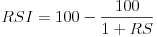
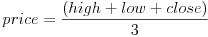
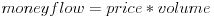
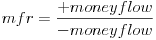
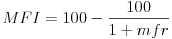
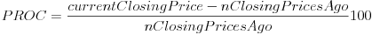
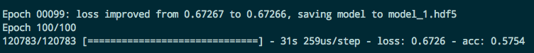
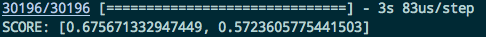
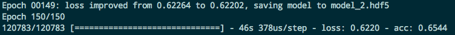
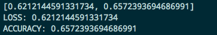

# Trading Bot

## Table of Contents
1. [Model](#model)
    * [Feature Selection](#feature-selection)
    * [List of Models](#list-of-models)
        * [model_1.h5](#model_1h5)
        * [model_2.h5](#model_2h5)
2. [How To Use Files](#how-to-use-files)
    * [Setup](#setup-envpy)
    * [Defining mySQL Tables](#defining-mysql-tables-create_schemapy)
    * [Getting Historical Data](#getting-historical-data-get_klinespy)
    * [Creating New Features](#creating-new-features-get_featurespy)
    * [Getting Feature Scaling Information](#getting-feature-scaling-information-get_feature_infopy)

## Model
### Feature Selection

| X Feature Name | Description |
| :------------: | :---------: |
| RSI (relative strength indicator) |  where RS is the average gain of up period / average gain of down period. |
| MFI (money flow index) |     often times called a *wieghted* RSI |
| PROC (price rate of change) |  change in price between periods |
| volume overall | Total volume of bought and sold of the quoted cryptocurrency |
| taker buy base asset volume | Total volume bought of the base ticker ETH of ETH/USDT |
| taker buy quote asset volume | Total volume bought of the quote ticker USDT of of ETH/USDT |
| high | The highest price reached in the kline interval |
| low | The lowest price reached in the kline interval |
| close | The closing price reached in the kline interval |
| LSMA (long simple moving average) | The average of the entire sequence's closing price |
| SSMA (short simple moving average) | The average of 1/3 of the sequence's most recent closing prices |

| Y Feature Name | Description |
| :------------: | :---------: |
| Next Klines Avg Price |  |
| Next Kline Avg Price One-Hot Encoding | put into categories... |
| Range | ... |
| Look a couple Klines ahead avg price | ... |
| Next kline volume | ... |

## List of Models

### model_1.h5
```
# Model Definition
MODEL = Sequential()
MODEL.add(LSTM(6, input_shape=(10, 12)))
MODEL.add(Dense(1, activation='sigmoid'))
MODEL.compile(loss='binary_crossentropy', optimizer='adam', metrics=['accuracy'])

# Model Fit
model.fit(x_train, y_train, epochs=100, batch_size=64, callbacks=[checkpoint])
```




### model_2.h5
```
# Model Definition
MODEL = Sequential()
MODEL.add(LSTM(12, input_shape=(10, 12)))
MODEL.add(Dense(4, input_shape=(12,)))
MODEL.add(Dense(1, activation='sigmoid'))
MODEL.compile(loss='binary_crossentropy', optimizer='adam', metrics=['accuracy'])

# Model fit
model.fit(x_train, y_train, epochs=150, batch_size=32, callbacks=[checkpoint])
```





## How To Use Files
### Setup (env.py)
Move **temp_env.py** into **scripts/env.py**.

Then fill out the information correctly for all the environment variables.

This is because **env.py** is in **.gitignore** to protect your credentials for Binance, AWS, MySQL etc.

<br/>

### Defining mySQL Tables (create_schema.py)

To create all the tables necessary for testing your model, run all scripts with the name create_schema.py

### Getting Historical Data (get_klines.py)

Utilize ```SELECT COUNT(*) FROM table_name;``` and  ```SELECT MAX(open_time) FROM table_name;``` when the query fails to update start at the last entry point recorded.

Can refer to **error.log** and **success.log** for more detailed failure report.

|Kline Time | Total # of Entries For Training Set |
| :-------: | :---------------------------------: |
| 1m | 151200 |
| 3m | 50400 |
| 5m | 30240 |

### Creating New Features (get_features.py)

Utilizing the historical data gotten from ```get_klines.py```, create new features and store them in the mysql database.

Specify the TableName and the interval of interest and for each feature, it will create a string with the same # of values as the interval. This can then be converted to a dataset ```training_rows * features * interval_size```

Ex: Given 10 features of interval size 5, 1 training entry would look like:
```
RSI: '30 40 35 60 90'
...
...
SSMA: '340 341.5 341.2 341 341.01'
y: '0 0 0 0 1'
```

### Getting Feature Scaling Information (get_feature_info.py)

Given a **csv**, **table_name** and **feature_name**, determine important statistics about the data such as:
```
min
max
mean
standard deviation
```
and save it in the table ```feature_info``` with the required columns:
```
table_name
feature_name
```


## TODO
1. update feature selection info to be more readable
2. save more model information
3. get some graphs
